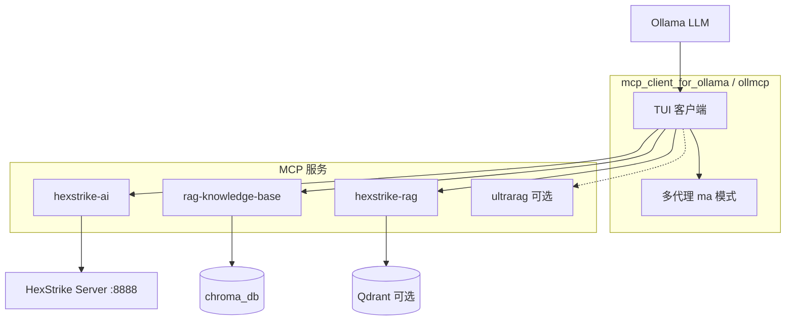

# HexStrike Augment

在 [MCP Client for Ollama (ollmcp)](https://github.com/jonigl/mcp-client-for-ollama) 基础上，集成 **HexStrike 安全自动化**、**双路 RAG 知识库** 与 **自主多代理** 调度，让本地 Ollama 模型通过 MCP 完成渗透测试辅助、漏洞知识检索与安全分析。

**仓库地址：** https://github.com/clutch-61/hexstrike_augment

---

## 特性

- **HexStrike AI**：通过子模块接入 [hexstrike-ai](https://github.com/0x4m4/hexstrike-ai)，提供大量安全测试 MCP 工具
- **双 RAG 知识库**
  - `rag-knowledge-base`：基于 ChromaDB + Ollama embedding 的轻量检索（`rag_knowledge_base/`）
  - `hexstrike-rag`：BM25 + 向量 + 重排完整管线，支持 Mock / Qdrant 生产模式（`hexstrike_rag/`）
- **自主多代理**：Strategy / Selector / Executor 三层架构，智能筛选工具、降低 token 开销（输入 `ma` 启用）
- **Ollama 本地推理**：兼容 tool calling，支持流式输出、HIL 人工确认、模型热切换等 ollmcp 能力

---

## 架构



---

## 仓库结构

```
hexstrike_augment/
├── mcp_client_for_ollama/     # ollmcp 客户端 + 多代理模块
├── mcp/                       # git 子模块 → hexstrike-ai
├── rag_knowledge_base/        # ChromaDB RAG 库
├── hexstrike_rag/             # 增强 RAG（BM25、Qdrant、重排等）
├── rag_mcp_server.py          # Chroma RAG MCP 入口
├── hexstrike_rag_mcp_server.py  # 增强 RAG MCP 入口
├── ultrarag_integration/      # UltraRAG 可选集成
├── build_knowledge_base.py    # 构建 Chroma 知识库
├── *.example.json             # MCP 配置模板（复制后改路径）
├── start_with_multi_agent.sh  # Linux 启动脚本
├── start_with_multi_agent.ps1 # Windows 启动脚本
└── HEXSTRIKE_INTEGRATION_GUIDE.md
```

详细说明见：

| 文档 | 内容 |
|------|------|
| [HEXSTRIKE_INTEGRATION_GUIDE.md](HEXSTRIKE_INTEGRATION_GUIDE.md) | HexStrike RAG 集成、Mock / 真实管线切换 |
| [RAG_KNOWLEDGE_BASE_README.md](RAG_KNOWLEDGE_BASE_README.md) | Chroma 知识库构建与使用 |
| [ULTRARAG_INTEGRATION.md](ULTRARAG_INTEGRATION.md) | UltraRAG 可选接入 |

---

## 环境要求

- Python 3.10+
- [Ollama](https://ollama.com/download)（本地运行，建议 `ollama pull qwen3` 等支持 tool calling 的模型）
- Git（含子模块支持）

可选（按功能启用）：

- HexStrike 后端服务（`http://localhost:8888`）
- Qdrant / Redis（`hexstrike-rag` 真实管线，见集成指南）
- `nomic-embed-text`（构建 Chroma 知识库时）

---

## 快速开始

### 1. 克隆与子模块

```bash
git clone --recursive https://github.com/clutch-61/hexstrike_augment.git
cd hexstrike_augment
```

若已克隆但未拉子模块：

```bash
git submodule update --init --recursive
```

### 2. 安装依赖

```bash
pip install mcp rich typer httpx ollama

# HexStrike MCP 子模块
pip install -r mcp/requirements.txt

# 增强 RAG（Mock 模式即可联调）
pip install -r hexstrike_rag_requirements.txt
```

### 3. 配置文件

所有 `*.example.json` 需复制为本地配置，并将 `<PROJECT_ROOT>` 替换为仓库绝对路径。

**Windows 示例：**

```powershell
copy hexstrike-with-rag-config.example.json hexstrike-with-rag-config.json
# 编辑 JSON，将 <PROJECT_ROOT> 改为 C:/Users/you/hexstrike_augment
```

**Linux / macOS 示例：**

```bash
cp hexstrike-with-rag-config.example.json hexstrike-with-rag-config.json
# 将 <PROJECT_ROOT> 改为 /path/to/hexstrike_augment
```

| 模板文件 | 用途 |
|----------|------|
| `hexstrike-mcp-config.example.json` | 仅 HexStrike |
| `hexstrike-with-rag-config.example.json` | HexStrike + 双 RAG（推荐） |
| `hexstrike_rag_config.example.json` | 仅增强 RAG |
| `rag_mcp_config.example.json` | 仅 Chroma RAG |
| `ultrarag_mcp_config.example.json` | UltraRAG（可选） |

> 本地 `*.json`（无 `.example` 后缀）已在 `.gitignore` 中，不会提交个人路径。

### 4. 启动 HexStrike 服务（使用 hexstrike-ai 时）

```bash
cd mcp
python hexstrike_server.py
# 默认 http://localhost:8888
```

### 5. 启动客户端

**方式 A：一键多服务（推荐）**

```powershell
# Windows
.\start_with_multi_agent.ps1
```

```bash
# Linux / macOS
chmod +x start_with_multi_agent.sh
./start_with_multi_agent.sh
```

**方式 B：手动指定配置**

```bash
python -m mcp_client_for_ollama.cli \
  --servers-json hexstrike-with-rag-config.json \
  --model qwen3:32b
```

### 6. 多代理模式

进入 ollmcp 交互界面后输入：

```
ma
```

然后用自然语言描述任务，例如：

> 请扫描 10.0.0.1 的 8080 端口，分析可能存在的 CVE 漏洞

Strategy Agent 会自主分解步骤、筛选工具并执行。

---

## MCP 服务一览

| 服务名 | 入口 | 说明 |
|--------|------|------|
| `hexstrike-ai` | `mcp/hexstrike_mcp.py` | 渗透测试自动化工具集 |
| `rag-knowledge-base` | `rag_mcp_server.py` | Chroma 漏洞/安全文档检索 |
| `hexstrike-rag` | `hexstrike_rag_mcp_server.py` | 增强检索 + `verify_payload_safety` |
| `ultrarag-knowledge-base` | `ultrarag_mcp_server.py` | 可选，需单独克隆 UltraRAG |

**hexstrike-rag 工具：**

- `search_security_knowledge` — 检索安全知识
- `get_knowledge_base_stats` — 知识库统计
- `verify_payload_safety` — Payload 风险校验

默认 `HEXSTRIKE_USE_MOCK=true`，无需 Qdrant 即可联调；生产环境见 [HEXSTRIKE_INTEGRATION_GUIDE.md](HEXSTRIKE_INTEGRATION_GUIDE.md)。

---

## 构建 Chroma 知识库（可选）

```bash
ollama pull nomic-embed-text
python build_knowledge_base.py --docs-dir ./data/extracted_readmes --rebuild
```

文档目录可通过环境变量 `RAG_DOCUMENTS_DIR` 或 `--docs-dir` 指定。

---

## 安全与合规

- 本项目面向**授权安全测试**与**安全研究**，请勿用于未授权目标。
- 勿将含 API Key、个人路径的配置提交到 Git；仓库仅保留 `*.example.json` 模板。
- 使用 HexStrike 与扫描类工具前，请确认目标在合法授权范围内。

---

## 致谢

- 客户端基础：[jonigl/mcp-client-for-ollama](https://github.com/jonigl/mcp-client-for-ollama)
- HexStrike：[0x4m4/hexstrike-ai](https://github.com/0x4m4/hexstrike-ai)

---

## 许可证

上游 ollmcp 组件遵循其原项目许可证；本仓库扩展部分请以各子模块及依赖项目许可证为准。
